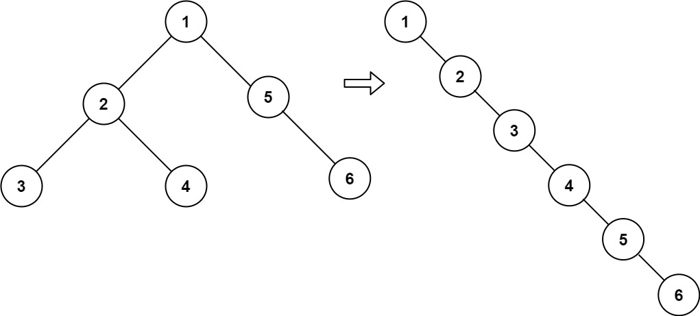

# 114. Flatten Binary Tree to Linked List

Given the `root` of a binary tree, flatten the tree into a "linked list":

- The "linked list" should use the same `TreeNode` class where the `right` child pointer points to the next node in the list and the `left` child pointer is always `null`.
- The "linked list" should be in the same order as a pre-order traversal of the binary tree.

---
## Explain

Example1

這題是要把 `TreeNode` 壓平(所有的節點都只有右子節點)
我們可以先遞迴, 從最底層開始  
1. 先把右節點存進 `tmp`
2. 讓右節點 `=` 左節點,
3. 左節點 `=` `null`
4. for-loop 到當前節點的最後一個右節點, 加上 `tmp`

## Code

[Code](./solution.go)